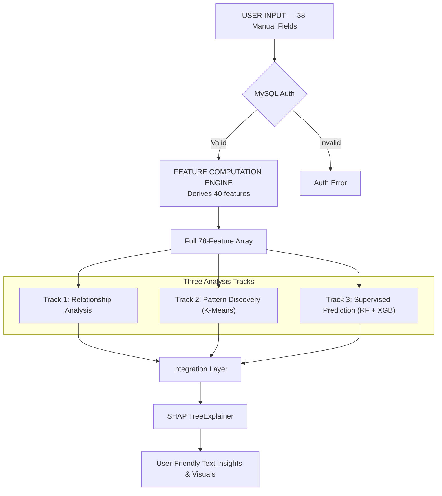

# BioLens — Health & Fitness Intelligence Platform
## Project Plan & Implementation Specification

---

# 1. Data Dictionary

Introduces the dataset and defines the raw data used by the system. The dataset structure has been overhauled to minimize user input while maximizing computed insights.

### 1.1 Dataset Overview
- **Total Columns**: 87 columns.
- **Inputs**: ~38 manual user inputs (read from user's smartwatch/health app).
- **Computed**: ~40 derived features computed mathematically.
- **Targets**: 8 ML output scores (predicted).
- **Excluded**: 1 (`participant_id`).
- **Data Source**: User enters snapshot values (today, 7d, 30d, 90d averages) directly. **No auto-fetch. No MySQL health log storage.** MySQL stores authentication only.

### 1.2 Column-by-Column Dictionary
#### Raw Inputs (~38 Fields)
**Demographics**: `age_years`, `sex_phys`, `height_cm`, `weight_kg`.
**Today's Vitals**: `resting_hr_bpm`, `hrv_rmssd_ms`, `spo2_pct`, `respiratory_rate_brpm`, `skin_temp_c`, `ecg_rhythm`, `irregular_rhythm_alert`.
**Today's Activity**: `steps_per_day`, `sedentary_hours_per_day`.
**Training**: `workout_days_per_week`, `avg_workout_duration_min`, `strength_sessions_per_week`.
**Sleep**: `sleep_duration_h`, `deep_sleep_pct`, `rem_sleep_pct`, `awakenings_per_night`, `sleep_consistency_score`, `breathing_disturbances_per_hr`.
**Cardiac History**: `irregular_rhythm_events_7d`, `irregular_rhythm_events_30d`.
**Optional Lab**: `fasting_glucose_mg_dl`.
**7-Day Averages**: `resting_hr_bpm_7d_avg`, `hrv_rmssd_ms_7d_avg`, `sleep_duration_h_7d_avg`, `steps_per_day_7d_avg`, `skin_temp_c_7d_avg`.
**30-Day Averages**: `resting_hr_bpm_30d_avg`, `hrv_rmssd_ms_30d_avg`, `sleep_duration_h_30d_avg`, `steps_per_day_30d_avg`, `vo2max_ml_kg_min_30d_avg`, `skin_temp_c_30d_avg`.
**90-Day Reference Points**: `resting_hr_bpm_90d_ago`, `hrv_rmssd_ms_90d_ago`, `sleep_duration_h_90d_ago`, `steps_per_day_90d_ago`, `vo2max_ml_kg_min_90d_ago`, `skin_temp_c_90d_ago`.

### 1.3 Key Data Quality Observations
Outliers and impossible values (e.g., resting HR < 30 or > 120, steps < 0) are handled by clipping or imputation. Since the system relies on manual inputs, range bounding ensures mathematical calculations do not fail on extreme human error.

### 1.4 Top Correlations (Pearson)
Strong correlations exist between:
- Resting HR & HRV (negative).
- Age & VO2 Max (negative).
- Sleep Consistency & Readiness Indicator (positive).

---

# 2. Derived Feature Catalogue

The backend computes the remaining features automatically. No ML is needed to generate these—they are deterministic.

### 2.1 Body Composition Domain
- `bmi`: Weight / Height²
- `body_fat_pct`: Deurenberg formula.
- `fat_free_mass_index`: (Weight × (1 - Body Fat%)) / Height²

### 2.2 Cardiovascular & Recovery Domain
- `avg_hr_bpm`: Resting HR + (Max HR - Resting HR) × 0.3
- `exercise_hr_bpm`: Inferred from cardio ratio.
- `autonomic_load_index`: Resting HR / HRV_RMSSD
- `age_adjusted_hrv`: Normalizes HRV for age-related decline.
- `resting_hr_age_delta`: Resting HR vs ACSM age norm.
- **Trend Deltas** (7 features): e.g., `resting_hr_bpm_trend_per_week` = (Today - 90d ago) / 13 weeks.

### 2.3 Sleep Domain
- `restorative_sleep_pct`: Deep Sleep % + REM Sleep %
- `restorative_sleep_hours`: Restorative % × Sleep Duration

### 2.4 Activity & Training Domain
- `active_minutes_per_day`: (Steps / 100) + Avg Workout Duration
- `weekly_workout_minutes`: Days × Duration
- `cardio_sessions_per_week`: Workout Days - Strength Sessions
- `strength_to_total_ratio`: Strength / Workout Days
- `steps_per_sedentary_hour`: Steps / Sedentary Hours
- `zone_low_min_per_week`, `zone_moderate_min_per_week`, `zone_high_min_per_week`: Estimated distributions.
- `training_load_7d_avg`, `training_load_30d_avg`: Weighted zone minute sums.

### 2.5 Metabolic & Respiratory Domain
- `calories_burned_kcal` / `energy_per_kg`: TDEE derived from Harris-Benedict.
- `vo2max_per_rhr`: VO2 Max / Resting HR.

### 2.6 Interaction Features (ML-Learned)
Interactions between sleep architecture, training load spikes, and autonomic load are left to Random Forest and XGBoost to model inherently.

---

# 3. System Architecture

### 3.1 High-Level System Architecture
- **Frontend (React)**: 38-field manual input form, rich dashboard with radar charts, domain scores (no raw numbers shown to user).
- **Backend (Flask/Python)**: Computes the 40 derived features, assembles the 78-feature array, runs ML inference.
- **Database (MySQL)**: Auth only. No daily logs.
- **Explainability (SHAP)**: Converts feature contributions into natural language insights.

### 3.2 Detailed Processing Pipeline



#### Track 1: Relationship Analysis
Pearson and Spearman correlation mappings performed during exploratory analysis.
#### Track 2: Pattern Discovery
K-Means clustering assigns users to "health archetypes" (e.g., "Fit but Stressed").
#### Track 3: Supervised Prediction
Tree-based regressors predict the 8 domain scores (0-100 scale) simultaneously.

### 3.3 Output Indicators (Output Layer Specifications)
Users see visual analytics and text, not raw ML calculation numbers.

#### Output Layer 1 — Domain Overview

##### 🕸️ Radar Chart (Spider Web)
All 8 domain scores plotted as a web. Shows **shape of health**.

##### 📊 Domain Score Cards with Directional Indicators
Each domain card shows:
- A colored status bar (red → amber → green)
- A trend arrow (↑ improving / ↓ declining / → stable)
- A single plain-English status line
- No raw numbers

#### Output Layer 2 — Per-Domain Deep Dive Charts

##### ❤️ Heart (Cardiovascular Score)
- HR Zone Donut Chart
- Resting HR Personal Baseline Gauge
- Text analysis of HR efficiency and rhythm

##### 🧠 Stress / Recovery (Recovery / Stress Score)
- HRV Trend Sparkline
- Autonomic Load Indicator
- Recovery Arc Chart

##### 😴 Sleep (Sleep Profile Score)
- Sleep Architecture Stacked Bar
- Sleep Consistency Calendar Heatmap
- Restorative Sleep Progress Bar
- Sleep Debt Gauge

##### 🫁 Respiratory (Respiratory Score)
- SpO₂ Stability Band Chart
- Respiratory Rate Trend Line

##### 🏃 Fitness (Fitness Profile Score)
- Fitness Age vs Actual Age Visual
- VO₂ Max Trend Line
- Aerobic Efficiency Gauge

##### 🚶 Movement (Activity / Movement Score)
- Active vs Sedentary Day Timeline
- Annual Projection Progress Rings
- Steps vs Personal Norm Bar

##### 🏋️ Training (Training Profile Score)
- Acute:Chronic Load Ratio Bar
- Zone Distribution This Week vs Last Week
- Training Load History Line

##### ⚡ Readiness (Readiness Indicator)
- Readiness Dial (hero visualization)
- Contributing Factors Visual (SHAP as horizontal bar chart)
- Daily recommendation text

#### Output Layer 3 & 4 — Overall Profile

##### 🔮 Predictive & Scenario Analytics
- What-If Scenario Comparison Chart
- 90-Day Trend Dashboard
- Year-End Projection Cards
- Reference Tables (WHO/ACSM percentile rankings)

##### 👥 Cluster & Population Context
- Health Archetype Card (K-Means cluster)
- Personal vs Population Comparison bars

---

# 4. Target Variable Strategy

### 4.1 Transparent Approach
The initial dataset generates 8 target scores based on weighted composite functions of the underlying features to bootstrap the models.

### 4.2 Why This Has Value Despite Circularity
Training tree models on synthetic targets forces the model to learn complex non-linear feature interactions, enabling the Scenario Engine to realistically simulate how input changes shift outputs.

### 4.3 Safeguards
These are prototype targets. The architecture allows swapping with true clinical endpoints without refactoring.

---

# 5. Tech Stack
- **Frontend**: React, Recharts
- **Backend API**: Flask / Python 3.10+
- **Database**: MySQL (Authentication only)
- **Processing**: Pandas, NumPy
- **ML / AI**: Scikit-Learn (Random Forest, K-Means), XGBoost
- **Explainability**: SHAP (TreeExplainer)

---

# 6. Implementation Plan & Task List

### 6.1 Phase Summary

| Phase | Name | Key Deliverable |
|---|---|---|
| 0 | Project Setup | Environment, dependencies, directory structure |
| 1 | Data Loading & Validation | Validated dataset, column mapping |
| 2 | Feature Engineering | `features.py` — computation functions for live inference |
| 3 | EDA & Correlation Analysis | Correlation matrices, statistical reports |
| 4 | K-Means Clustering | Cluster model, archetype definitions |
| 5 | Target Validation | Verify synthetic targets in dataset |
| 6 | Supervised ML Training | RF + XGB models, joblib artifacts |
| 7 | SHAP Explainability | SHAP integration, text insight templates |
| 8 | Flask API | `/api/predict`, `/api/scenario` endpoints |
| 9 | React Frontend | Input form, 30+ chart components, dashboard |
| 10 | Integration & Polish | E2E testing, UI responsiveness |

### 6.2 Detailed Task List

See [task_list.md](file:///Users/maitrayeedighe/biolens/task_list.md) for the granular task breakdown with checkboxes.

### 6.3 Project Directory Structure
```text
biolens/
├── data/
│   ├── biolens_dataset_fixed.csv
│   ├── generate_extended_dataset.py
│   └── validate_dataset.py
├── notebooks/
│   └── eda_analysis.py
├── models/
│   ├── rf_model.joblib
│   ├── xgb_model.joblib
│   ├── kmeans_model.joblib
│   └── scaler.joblib
├── backend/
│   ├── app.py
│   ├── features.py
│   ├── scenario.py
│   ├── explain.py
│   └── config.py
├── frontend/
│   ├── src/
│   │   ├── components/
│   │   └── pages/
│   ├── package.json
│   └── public/
├── project_plan.md
├── task_list.md
└── requirements.txt
```

---

# 7. Algorithm Summary by Pipeline Stage

| Stage | Algorithm / Technique |
|---|---|
| Validation | Strict boundary clipping (Min/Max) |
| Feature Engineering | Deterministic formulas (Deurenberg, Harris-Benedict) |
| Correlation | Pearson (linear), Spearman (monotonic) |
| Dependency Analysis | Feature importance (Gini impurity from RF) |
| Multicollinearity | VIF (Variance Inflation Factor) checks |
| Normalization | StandardScaler (for K-Means) |
| Cluster Selection | Silhouette score |
| Clustering | K-Means |
| Supervised ML | Random Forest Regressor, XGBoost Regressor |
| Evaluation | RMSE, R² |
| Tuning | GridSearchCV |
| Explainability | SHAP (Shapley Additive exPlanations) |
| Explanation Generation | Rule-based text templating over SHAP values |

---

# 8. Medical Scope Disclaimer

> [!CAUTION]
> **Medical Disclaimer:** These scores, recommendations, and what-if scenarios represent pattern-based assessments derived from self-reported lifestyle data. They are not clinical diagnoses. The system cannot detect heart rhythm disorders, deep sleep apnea, respiratory disease, or other medical conditions. These require appropriate clinical measurements and professional evaluation.
